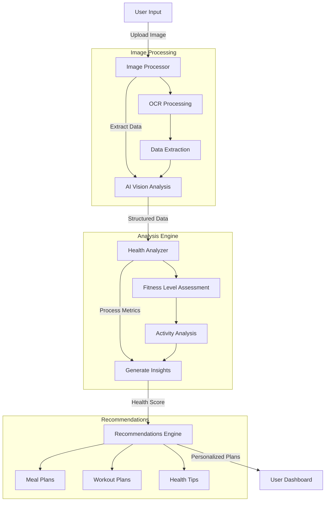

# AI Fitness Health Analyzer 🏃‍♂️💪

An advanced AI-powered fitness analytics system that processes fitness data from images and provides personalized health recommendations.

## 📊 System Architecture



## ✨ Features

- 🖼️ **AI Vision Analysis**: Process fitness summary images using Google Gemini 1.5-flash
- 📈 **Health Metrics**: Extract and analyze steps, calories, distance, and more
- 🎯 **Personalized Insights**: Generate tailored health recommendations
- 📊 **Data Visualization**: Interactive charts and progress tracking
- 🥗 **Custom Plans**: Personalized meal and workout suggestions

## 🚀 Quick Start

### Prerequisites

- Python 3.8 or higher
- pip (Python package manager)

### Installation

1. **Clone the repository**
```bash
git clone https://github.com/Nitishkumarmaury/AI-Fitness-Health-Analyzer.git
cd AI-Fitness-Health-Analyzer
```

2. **Set up Python virtual environment**
```bash
# Windows
python -m venv venv
.\venv\Scripts\activate

# Linux/Mac
python3 -m venv venv
source venv/bin/activate
```

3. **Install dependencies**
```bash
pip install -r requirements.txt
```

4. **Configure Environment Variables**
Create a `.env` file in the project root:
```env
GEMINI_API_KEY=your_api_key_here
```

5. **Run the Application**
```bash
streamlit run main.py
```

## 💻 Usage Guide

1. **Upload Fitness Data**
   - Launch the application
   - Click "Upload Image" button
   - Select a fitness summary image

2. **View Analysis**
   - Review extracted metrics
   - Check health insights
   - View progress charts

3. **Get Recommendations**
   - Review personalized health tips
   - Access custom meal plans
   - View suggested workouts

## 📋 Project Structure

```
ai-fitness-analyzer/
├── src/
│   ├── main.py              # Application entry point
│   ├── image_processor.py   # Image processing logic
│   ├── health_analyzer.py   # Health analysis engine
│   └── utils/              # Utility functions
├── tests/                  # Unit tests
├── requirements.txt        # Project dependencies
└── README.md              # Project documentation
```

## 🔍 Key Components

### 1. Image Processor
- Handles image upload and preprocessing
- Integrates with Google Gemini Vision AI
- Extracts text and numerical data

### 2. Health Analyzer
Processes fitness metrics with these categories:
- **Steps Analysis**:
  - Very Active: ≥12,000 steps
  - Active: 8,000-11,999 steps
  - Moderately Active: 5,000-7,999 steps
  - Lightly Active: 2,500-4,999 steps
  - Sedentary: <2,500 steps

- **Calorie Analysis**:
  - High Burn: ≥400 calories
  - Moderate Burn: 200-399 calories
  - Low Burn: <200 calories

### 3. Recommendations Engine
Generates personalized suggestions for:
- Daily activity goals
- Nutrition plans
- Exercise routines
- Health improvement tips

## 📊 Sample Analysis

When you upload a fitness summary image, the system will:
1. Extract numerical data (steps, calories, distance)
2. Analyze activity patterns
3. Generate health insights
4. Provide personalized recommendations

Example Output:
```python
{
    "metrics": {
        "steps": 8,543,
        "calories": 320,
        "distance": 6.2
    },
    "fitness_level": "active",
    "recommendations": [
        "Great job maintaining an active lifestyle!",
        "Consider adding strength training 2-3 times per week",
        "Aim for 10,000 steps to reach the next fitness level"
    ]
}
```

## 🛠️ Development

### Running Tests
```bash
python -m pytest tests/
```

### Code Style
```bash
# Install linting tools
pip install flake8 black

# Run linter
flake8 .

# Format code
black .
```

## 📝 API Documentation

### Image Processing API
```python
def process_image(image_path: str) -> dict:
    """Process fitness image and extract metrics"""
    return {
        "steps": int,
        "calories": int,
        "distance": float
    }
```

### Health Analysis API
```python
def analyze_fitness(metrics: dict) -> dict:
    """Generate health insights from metrics"""
    return {
        "fitness_level": str,
        "recommendations": List[str],
        "health_score": float
    }
```

## 🤝 Contributing

1. Fork the repository
2. Create a feature branch
3. Commit your changes
4. Push to the branch
5. Open a Pull Request

## 📄 License

This project is licensed under the MIT License - see the LICENSE file for details.

## 👥 Authors

- **Nitish Kumar Maurya** - *Initial work* - [Nitishkumarmaury](https://github.com/Nitishkumarmaury)

## 🙏 Acknowledgments

- Google Gemini AI for vision processing
- Streamlit for the web interface
- The open-source community for various tools and libraries

## 📞 Support

For support, email nitishkumarmaurya@example.com or open an issue in the repository.
